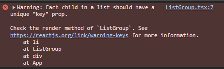
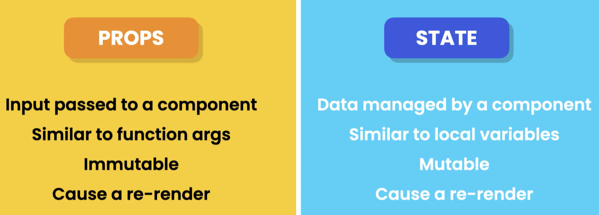

# React FAQs

Esta secção é dedicada a dicas e boas práticas de React 🚀

### 1. ClassName em vez de class

Quando utilizamos react nas nossas apps, passamos a usar "className" para definir as classes de css. A keyword "class" está reservada para algumas coisas do React

### 2. Code wrap

Se tentarmos retornar definir uma função a qual tenha de renderizar vários elementos sem uma tag geral que os envolve a todos, iremos ter uma erro. Isto é porque é necessário ter algo a envolver todo o HTML dentro de uma função. Exemplo:

```javascript
return(
    <h1>List</h1>
    <ul className="list-group">
        <li className="list-group-item">An item</li>
        <li className="list-group-item">A second item</li>
    </ul>
);
```

Para resolver isto, teremos que colocar tudo dentro de uma tag geral, algo assim:

```javascript
return (
  <div>
    <h1>List</h1>
    <ul className="list-group">
      <li className="list-group-item">An item</li>
      <li className="list-group-item">A second item</li>
    </ul>
  </div>
);
```

Esta não é a melhor solução, porque é mais um elemento que o react tem de renderizar, para resolver isso, podemos usar os fragments para resolver o problema:

```javascript
return (
  <Fragment>
    <h1>List</h1>
    <ul className="list-group">
      <li className="list-group-item">An item</li>
      <li className="list-group-item">A second item</li>
    </ul>
  </Fragment>
);
```

Para não termos de importar o Fragment, podemos fazer desta forma:

```javascript
return (
  <>
    <h1>List</h1>
    <ul className="list-group">
      <li className="list-group-item">An item</li>
      <li className="list-group-item">A second item</li>
    </ul>
  </>
);
```

### 3. Usar map em vez de for e for each

Quando estamos no meio de jsx/tsx, não conseguimos usar for ou foreach, para isso podemos usar como alternativa o map(). Neste caso, usamos o map para pegar num item de um array e convertê-lo para um elemento HTML:

```javascript
function ListGroup() {
  const items = ["New York", "San Francisco", "Tokyo", "London", "Braga"];

  return (
    <>
      <h1>List</h1>
      <ul className="list-group">
        {items.map((item) => (
          <li className="list-group-item">{item}</li>
        ))}
      </ul>
    </>
  );
}
```

### 4. Keys

Para que o React consiga saber que cada elemento é único, teremos que adicionar uma key para cada um, desta forma ele consegue dar track a cada um desses elementos.
Para tal, temos de fazer o seguinte:



### 5. Operador &&

Para facilitarmos certas coisas no react, o devs acabam por utilizar a expressão && em verificações, como no caso que temos a seguir. Isto serve para tornar o código mais simples de ler e escrever:
`{items.length === 0 && <p>No items found 😱</p>}`
De seguida temos uns exemplos de outputs para este operador &&

```javascript
//true && 1 -> 1
//true && "Test" -> "Test"
//false && "Test" -> false
```

### 6. useState hook

Um hook permite-nos aceder a algumas features do React.
O useState devolve um array e sendo que esse array possui duas coisas:

- a primeira posição do array vai ser a nossa variável com o state -> selectedIndex
- a segunda posição do array será uma função para fazer o update do valor da variável

O valor que vai dentro do setState é o valor inicial para a propriedade

```javascript
const [selectedIndex, setSelectedIndex] = useState(-1);
```

### 7. Destructuring de objetos

No exemplo das props, em que passamos de um component para o outro, se usarmos diretamente sem fazer o destructor das propriedades, teriamos que fazer "props." para poder aceder às propriedades, o que podemos fazer é fazer algo deste género:

```javascript
interface Props {
  items: string[];
  heading: string;
}

function ListGroup({ items, heading }: Props) {...}
```

### 8. Diferença entre props e state



### 9. Atualizar objectos

Para podermos atualizar objectos, não podemos simplesmente pegar no objecto que nos é passado e alterar os seus valores, isso no react não funciona.
A melhor forma de o fazer será criar um objecto novo, atualizar as propriedades que queremos e de seguida atualizar o estado com os hooks respetivos, algo desta forma:

```javascript
functions App(){
  const [drink, setDrink] = useState({
    title: "Americano",
    price: 5
  });

  const handleClick = () => {
    const newDrink = {
      title: drink.title,
      price: 6
    }

    setDrink(newDrink);
  }
}
```

Tal como as proprs, devemos tratar os objectos como immutable ou read only.
Se tivermso muitas propriedades neste objecto, o que podemos fazer é usar o spread operator (...) e atualizar apenas as propriedades que queremos, algo deste género:

```javascript
functions App(){
  const [drink, setDrink] = useState({
    title: "Americano",
    price: 5
  });

  const handleClick = () => {
    const newDrink = {
      ...drink
      price: 6
    }

    setDrink(newDrink);
  }
}
```

### 10. Nested Objects

Para objectos dentro de objectos, podemos fazer desta forma para atualizar alguns valores:

```typescript
functions App(){
  const [customer, setCustomer] = useState({
    name: "John",
    address: {
      city: "San Francisco",
      zipCode: 94111
    }
  });

  const handleClick = () => {
    setCustomer({
      ...customer,
      address: {...customer.address, zipCode: 94112}
    });
  };
}
```

Em cima, estamos a atualizar o objecto customer, sendo que queremos atualizar apenas o "zipCode", para isso podemos usar o spread operator e depois tratar de cada object interno individualmente

### 11. Atualizar arrays

Os arrays podemos atualizar usando o spread operator:

```typescript
functions App(){
  const [tags, setTags] = useState(["happy", "cheerful"]);

  const handleClick = () => {
    //add
    setTags([...tags, "exciting"]);

    //remove
    setTags(tags.filter(tag => tag !== "happy"));

    //update
    setTags(tags.map(tag => tag === "happy" ? "happiness" : tag));
  };
}
```

### 12. Atualizar um array de objectos

Para atualizar um array de objectos, podemos fazer o seguinte:

```typescript
functions App(){
  const [bugs, setBugs] = useState([
    {id: 1, title: "Bug 1", fixed: false},
    {id: 2, title: "Bug 2", fixed: false},
  ]);

  const handleClick = () => {
    setBugs(bugs.map(bug => bug.id === 1 ? {...bug, fixed: true} : bug));
  };
}
```

Aqui só alteramos o objecto que pretendemos e não o array todo

Podemos também usar o Immer para fazer estas alterações da seguinte forma:

```typescript
functions App(){
  const [bugs, setBugs] = useState([
    {id: 1, title: "Bug 1", fixed: false},
    {id: 2, title: "Bug 2", fixed: false},
  ]);

  const handleClick = () => {
    //aqui vamos usar o método produce, do immer, o qual recebe uma arrow function
    //chamamos draft ao objecto que vamos usar. Este vai tar a par das alterações que vamos fazer ao objecto que queremos
    setBugs(
      produce((draft) => {
        //aqui usamos o draft.find() para encontrar o objecto que queremos
        const bug = draft.find((bug) => bug.id === 1);
        if (bug) bug.fixed = true;
      })
    );
  };
}
```

### 13. Partilhar o estado entre components

Para podermos partilhar o estado entre dois componentes, as alterações do state deste devem ser feitas no pai direto desses dois mesmos componentes de forma que possam receber a informação a partir das props.
Por exemplo, temos um site de e-commerce, em que temos uma navbar que tem o número de items no carrinho e o carrinho com os produtos. Se adicionar algo ao carrinho, eu tenho de atualizar ambos os components para que possam ter a informação correta, uma para saber o número de items no carrinho e a outra com a lista dos mesmos.

### 14. useEffect

O useEffect é utilizado para executar um pedaço de código após um componente ter sido renderizado.

```typescript
functions App(){
  const ref = useRef<HTMLInputElement>(null);

  //o que acontece dentro do if iria fazer com que o nosso componente não fosse puro, isto porque iria alterar a DOM. Para isso, utilizamos o useEffect para controlar esta situação
  //o useEffect só o podemos chamar no "top level" do nosso componente, ou seja, não podemos chamar dentro de ifs e loops
  useEffect(() => {
    if(ref.current)
      ref.current.focus();
  });

  return(
    <div>
      <input ref={ref} type="text" className="form-control" />
    </div>
  );
}
```

### 15. Loops no useEffect

O código a seguir irá originar um loop infinito, pelo que estará sempre a executar. Isto deve-se ao facto de o useEffect ser chamado após cada render, ao fazermos update do state, ao usar o useState, é feito mais um render, e isto vai fazer com que ambos entrem em loop infinito:

```typescript
const [products, setProducts] = useState<string[]>([]);

useEffect(() => {
  console.log("Fetcing products");
  setProducts(["Clothing", "Household"]);
});
```

Para resolver isto, temos de passar um segundo argumento ao useEffect para que possamos controlar este comportamento. Este segundo argumento é um array de dependências, se alguma dessas depedências se alterar, o React irá chamar novamente o useEffect, pelo que podemos passar algo do género:

```typescript
const [products, setProducts] = useState<string[]>([]);

useEffect(() => {
  console.log("Fetcing products");
  setProducts(["Clothing", "Household"]);
}, []);
```

O problema da usar um array vazio, é que este não está à espera de nenhuma alteração, pelo que se usarmos o useEffect e quisermos renderizar um component, se este tiver esta dependências sem nada no array, este não irá renderizar mais nada. Para se resolver esse problema, devemos passar uma dependência a qual este hook deverá acompanhar, segue em baixo um exemplo:

```typescript
const ProductList = ({ category }: { category: string }) => {
  const [products, setProducts] = useState<string[]>([]);

  useEffect(() => {
    console.log("Fetcing products in ", category);
    setProducts(["Clothing", "Household"]);
  }, [category]);
  return <div>ProductsList</div>;
};
```

Desta forma, o useEffect vai acompanhar as alterações que são feitas ao category, e sempre que este alterar o useEffect é chamado.

### 16. Limpar o useEffect

Existem alturas em que precisamos de desfazer certas coisas que o useEffect faz. Por exemplo, se temos uma app de chat, quando o user sai da janela da app, podemos desconectar o user de forma a poupar recursos. Neste caso, temos um exemplo de momentos em que pretendemos fazer um clean do que o useEffect fez, que neste caso foi criar a conexão, por isso, pretendemos desconectar.

```typescript
const connect = () => console.log("Connecting");
const disconnect = () => console.log("Disconnecting");

function App() {
  //neste useEffect, estamos a dizer que
  useEffect(() => {
    connect();

    return () => disconnect(); //esta é a função de clean up do useEffect, esta nem sempre é necessária
  }, []);
}
```

De uma forma muito resumida, a nossa função de clean up, deve desfazer o que o useEffect fez, a seguir temos uns exemplos:

- se tivermos a mostrar uma modal com o useEffect, devemos usar a clean up para esconder a modal
- se formos buscar dados, devemos ou abortar, ou ignorar o resultado

